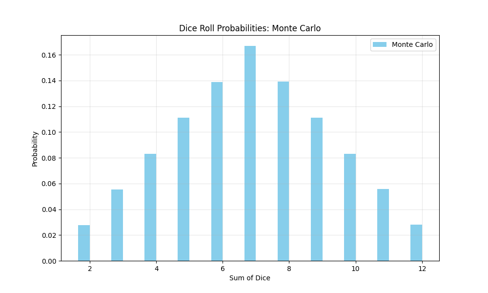

```bash
python3 -m venv venv
source venv/bin/activate
pip freeze > requirements.txt
pip install -r requirements.txt
```

Висновки до завдання 7:

Отримані результати:



Отримані результати приблизно збігаються з таблицею наведеною у завданні. Результати 6, 7 і 8 мають найбільші ймовірності. Результати слідують нормальному розподілу.
